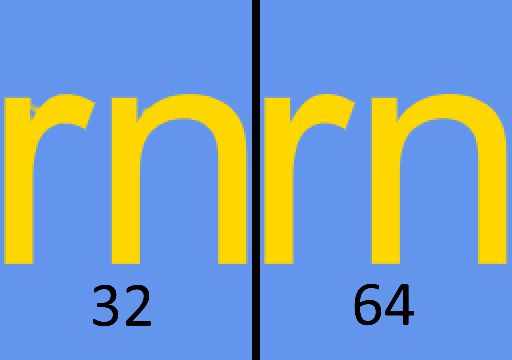

# MSDF
A signed distance field font renderer for monogame. It is based off [roy-t/MSDF](https://github.com/roy-t/MSDF), adding features, improving performance and reducing the number of dependencies.

This project uses [msdf-atlas-gen](https://github.com/Chlumsky/msdf-atlas-gen) to generate signed distance field font atlases and renders them with a shader.

## The content pipeline project
This sample includes a content pipeline project for Monogame 3.8. The content processor requires you set the path to the msdf-atlas-gen binary.

## The game project
The game project contains a simple utility class and shader to draw 3D moving text.

# Using this in your own project
For an example and more information of how to use this in your own project, see [my other repo](https://github.com/Peewi/MonoMSDF-Example).

# Formatting
https://user-images.githubusercontent.com/57567487/164911304-70409d4a-528b-438b-873b-dce05eb81a36.mp4

Formatting is supported through the use of tags. There are no closing tags. Each tag changes the formatting from that point forward, overriding any previous tag of the same type. All tags and arguments are case insensitive.

As of writing, the available tags are:
* `[color <color>]`, alias `[fill <color>]`. Type: `FillColor`. Sets the fill color of the text. Additionally a color on its own works as this tag. The accepted formats for colors are hex colors in `#RRGGBB` or `#RRGGBBAA`, values 0-255 in the formats `R G B` or `R G B A`, and color names. When a color name is used or alpha is omitted, the alpha of the fill color passed to `TextRenderer.LayoutText` is used. Examples: `[#ff0000]`, `[fill 0 128 0 128]`, `[blue]`.
* `[stroke <color>]`. Type: `StrokeColor`. Sets the stroke color of the text. Accepts same color formats as `color`. Example: `[stroke white]`.
* `[offset <x> <y>]`. Type: `PositionOffset`. Offsets the text by this amount, multiplied by the current scale. Takes two numbers to use as x and y values or a single number to use for both x and y. Examples: `[offset 3 4]`, `[offset 2.5]`.
* `[scale <number>]`. Type: `Scale`. Scales the text. Multiplies the value that was passed to `TextRenderer.LayoutText`. Examples: `[scale 4]`, `[scale 1.5]` Note: Mixing multiple scales in one piece of text works, but is unlikely to result in a good looking layout.
* `[lineheight <number>]`. Type: `LineHeight`. Changes the line height of the text. Multiplies the value of the font or that was passed to `TextRenderer.LayoutText`. Example `[lineheight 1.6]`
* `[sine]`. Type: `LetterPositionOffset`. Animates the letters in a sine wave. Example `[sine]`.
* `[shake]`. Type: `LetterPositionOffset`. Animates the letters to shake erratically. Example `[shake]`.
* `[rainbowfill]`, alias `[rainbow]`. Type: `FillColor`. Animates the fill color of the text. Example: `[rainbow]`.
* `[rainbowstroke]`  Type: `StrokeColor`. Like `[rainbowfill]`, but for the stroke color. Example: `[rainbowstroke]`.
* `[end <tagtypes>]`. Resets formatting to the default/what was passed to `TextRenderer.LayoutText`. Accepts any number of tag types at the same time. Examples: `[end color]`, `[end scale letterposition color]`

The types of tag are:
* `FillColor`, aliases: `Fill` and `Color`.
* `StrokeColor`, alias: `Stroke`.
* `PositionOffset`, aliases: `Offset` and `Position`.
* `LetterPositionOffset`, aliases: `LetterPosition` and `LetterOffset`. Methods associated with `LetterPositionOffset` tags are executed for every letter in the layouted text, while methods for other tags are only executed once during text layouting.
* `Scale`
* `LineHeight`
* `Kerning`
* `Special`. Special tags do not have any direct effect on the text formatting, but can be used to run arbitrary code when layouting text. There are currently no special tags.

Adding your own tags is easy. Simply create a method that matches one of the delegates in `Formatting` and call `Formatting.RegisterTag`. Example: `RegisterTag("color", fillFunction: FormattingFunctions.ColorFunction)`. Note that some of the delegates have identical signatures, so you may be required to explicitly provide the paremeter name.

# Parameters
The field font processor has two parameters that influence the generation of the font atlas.
## Resolution
The resolution parameter controls how large each glyph is in the font atlas. Larger resolution better preserves small details of the font. Distortions in the font might not be visible when rendered at a small size, but become visible when rendered at a larger size.

This comparison shows a closeup of the letters r and n in the font Arial, rendered at a large size, using resolution 32 and 64 respectively.

## Range
Range determines how far the distance field extends beyond the glyphs in the font atlas. A higher range allows the rendering of smaller text with anti aliasing. Range also determines the width of the text stroke.

# Why (multi-channel) signed distance fields?

Signed distance fields are a technique first described by Valve in [this paper](https://steamcdn-a.akamaihd.net/apps/valve/2007/SIGGRAPH2007_AlphaTestedMagnification.pdf). In short a signed distance field is a sort-of height map. Where sea-level are the actually boundaries of the glyph. Everything above sea level is outside the glyph, and everything below sea level is inside the glyph. When a height map is upscaled the GPU fills in the gaps using linear interpolation. The linear interpolation of the height map introduces less noise/faults than interpolating a sharp boundary would do, but we still get the same information.

Traditional signed distance fields only use one channel, but they sometimes have trouble representing sharp corners. Multi-channel signed distance fields solve this problem by using three color channels to store slope information.

# Advantages

- High quality text rendering 
- Low memory usage
- Fast rendering (the shader is very simple)

# Drawbacks

- No automatic mechanism to determine the right signed distance field size to capture all details
- No multi-color glyphs (like emoji)
- Straight lines might look slightly wavery sometimes

# Alternatives

- SpriteFonts, the standard in XNA and MonoGame, look good when rendered at the same size as the sprites were saved, but upscaling and downscaling quickly leads to a serious degradation in quality.
- A library like [slug](http://sluglibrary.com/) which renders text directly from the outline data in the font. So no details are missed and no manual configuration is required.
